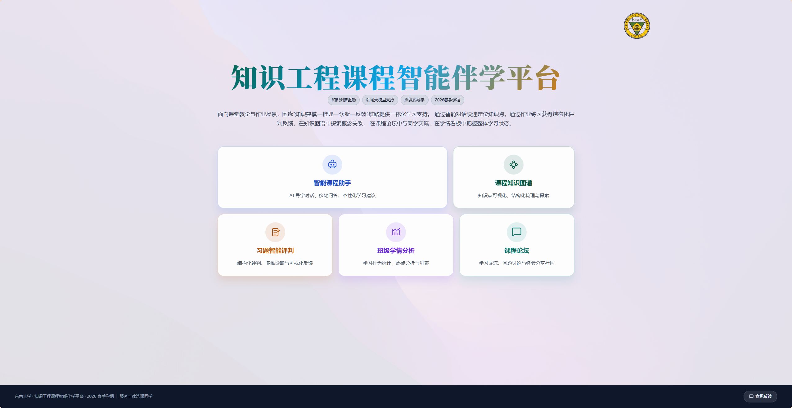
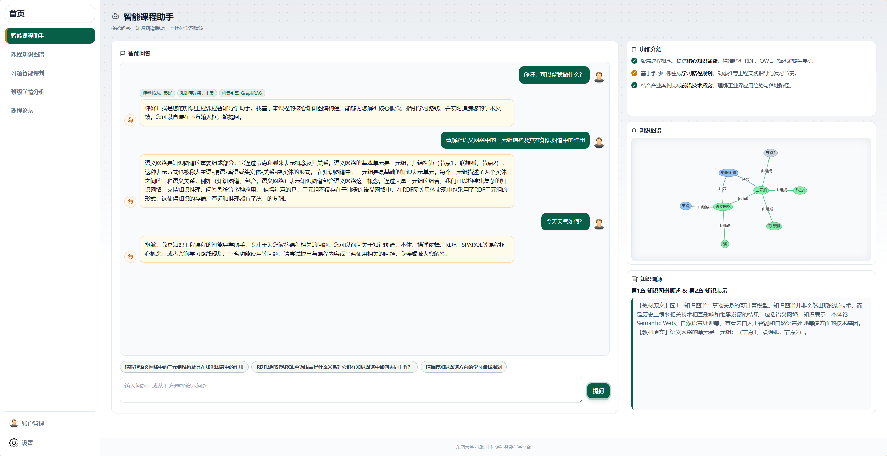
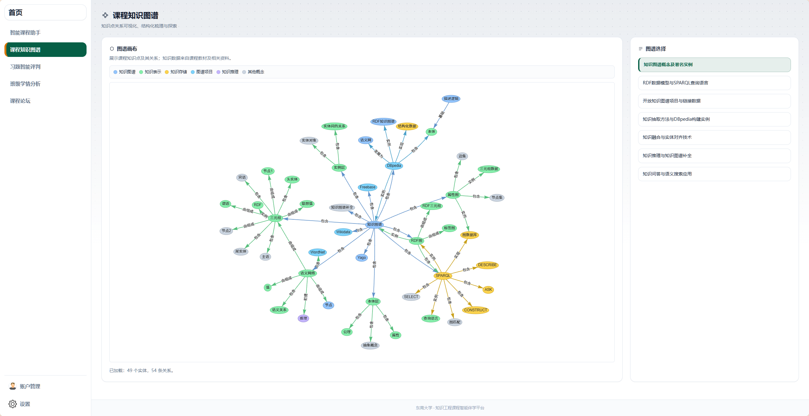
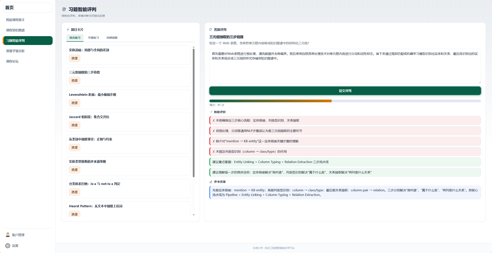
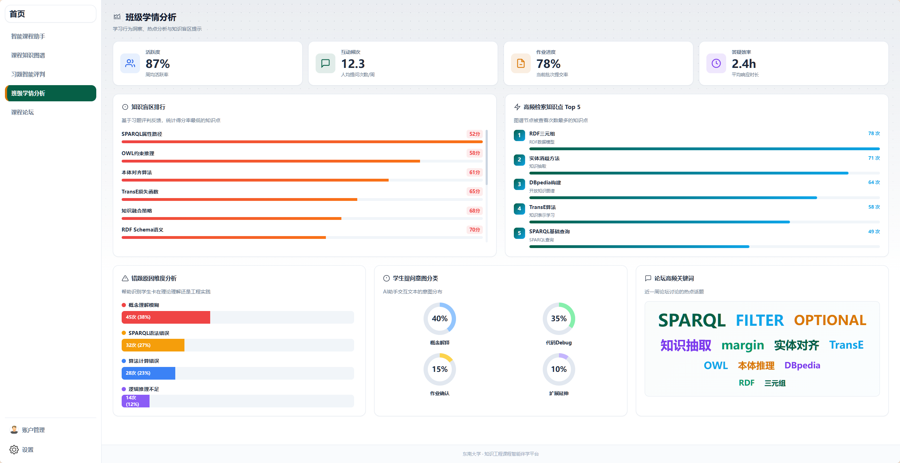
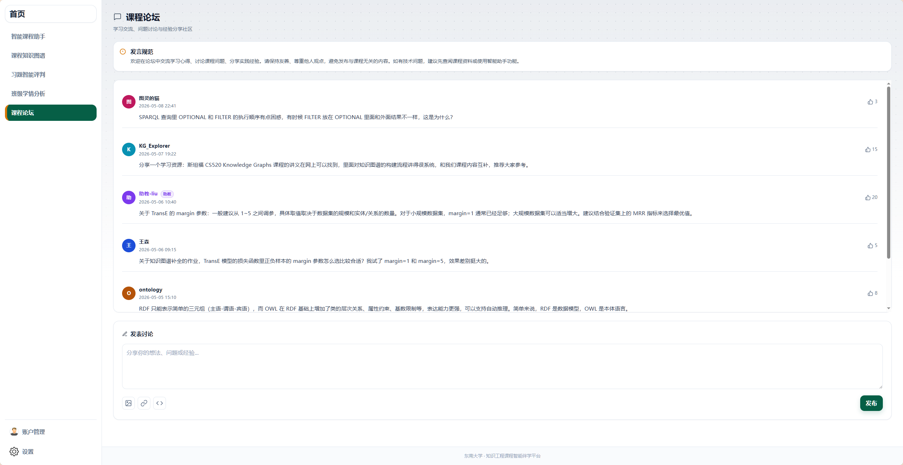

# 知识工程课程智能伴学平台

> 东南大学 · 2026 春季学期  
>
> **知识图谱驱动 × 领域大模型支持 × 启发式导学**

---

## 🎬 平台功能演示

以下视频完整展示了知识工程课程智能伴学平台的各页面功能与交互效果，包括智能课程助手的 AI 问答与知识图谱联动、课程知识图谱的交互式浏览、习题智能评判的多维诊断反馈、班级学情分析的数据看板，以及课程论坛的讨论交流场景。

<video src="figs/案例视频.mp4" controls width="100%">
  您的浏览器不支持视频播放，请下载后观看：<a href="figs/案例视频.mp4">案例视频.mp4</a>
</video>

> 📁 视频文件：[figs/案例视频.mp4](figs/案例视频.mp4)

---

## 📌 项目简介

**知识工程课程智能伴学平台**是面向东南大学「知识工程」课程的一体化智能教学辅助系统。平台围绕"**知识建模 — 推理 — 诊断 — 反馈**"核心链路，将课程知识图谱与经过领域微调的大语言模型深度融合，为选课同学提供覆盖课前预习、课中互动、课后巩固全场景的个性化学习支持。

## 🏠 一、平台首页

首页提供清晰的导航与功能总览。

### 功能卡片一览

| 卡片 | 说明 |
|------|------|
| 🤖 智能课程助手 | AI 导学对话、多轮问答、个性化学习建议 |
| 🕸️ 课程知识图谱 | 知识点可视化、结构化梳理与探索 |
| 📝 习题智能评判 | 结构化评判、多维诊断与可视化反馈 |
| 📊 班级学情分析 | 学习行为统计、热点分析与洞察 |
| 💬 课程论坛 | 学习交流、问题讨论与经验分享社区 |

### 其他功能

- **意见反馈弹窗**：右下角悬浮按钮，点击弹出反馈窗口，支持提交关于课程内容和平台功能的改进建议。

---

## 🤖 二、智能课程助手

基于领域微调大模型与课程知识图谱的 **AI 对话问答系统**，采用三栏布局，是平台的核心功能模块。

### 2.1 智能问答（左侧主对话区）

这是学生与 AI 助手交互的核心区域。

- **自然语言提问**：学生可直接输入自然语言问题，系统基于课程知识图谱和领域微调大模型返回精准、语义化的回答
- **演示问题快捷入口**：提供 3 个预设演示问题（如三元组结构解释、RDF 与 SPARQL 关系、学习路线规划），点击即可填入输入框并自动发起对话
- **流式输出渲染**：AI 回答采用逐词流式渲染方式呈现，模拟真实大模型的实时生成效果，提供流畅的交互体验
- **多轮对话支持**：系统保持对话上下文记忆，支持追问、澄清、深入讨论等多轮交互场景
- **无关问题过滤**：当检测到学生提出与课程无关的问题时，系统会自动提示"请聚焦于知识工程课程相关领域"，引导学生专注于课程学习
- **首次欢迎对话**：首次进入页面时自动发起欢迎对话，并展示系统状态标签（模型状态 ✅、知识库连接 ✅、检索引擎 GraphRAG ✅）

### 2.2 功能介绍（右侧面板上部）

展示助手的三大核心能力。

| 能力          | 说明                                                       |
| ------------- | ---------------------------------------------------------- |
| 核心知识答疑  | 聚焦课程概念，精准解析 RDF、OWL、描述逻辑、SPARQL 等要点   |
| 学习路径规划  | 基于学习画像生成个性化推荐，动态推荐工程实践指导与复习节奏 |
| ✅前沿技术拓宽 | 结合产业案例理解工业界应用趋势与落地路径                   |

### 2.3 知识图谱可视化（右侧面板中部）

根据当前问答内容动态渲染**局部知识图谱**。

- 使用 **vis-network** 库进行交互式图谱渲染
- 节点按类别着色（知识表示、知识存储、图谱项目、知识推理等）
- 支持节点拖拽、缩放、悬停高亮等交互操作
- 帮助学生直观理解当前问题涉及的概念及其语义关联关系

### 2.4 知识溯源（右侧面板下部）

展示 AI 回答的知识来源，增强可信度与可验证性。

- **引用章节**：显示回答引用的教材章节名称
- **原文摘录**：展示教材中的原始段落文本，学生可对照原文验证AI回答

## 🕸️ 三、课程知识图谱

全屏交互式知识图谱浏览页面，帮助学生直观地理解课程知识体系的结构与概念间的关系。

### 3.1 交互式图谱可视化（左侧主画布）

- 使用 **vis-network** 渲染完整的课程知识图谱网络
- **节点交互**：支持节点拖拽定位、鼠标滚轮缩放、悬停时高亮相邻节点
- **节点着色**：按知识类别为节点分配不同颜色
  - 🔵 蓝色：知识图谱相关概念
  - 🟢 绿色：知识表示
  - 🟡 黄色：知识存储
  - 🌐浅蓝：图谱项目
  - 🟣 紫色：知识推理
  - ⚪ 灰色：其他概念
- **图例标识**：画布上方提供清晰的图例说明，帮助学生快速区分节点类别
- vis-network 不可用时自动降级为 JSON 文本展示，确保功能可用性

### 3.2 主题选择器（右侧边栏）

提供 **7 个课程主题**的快速切换入口，每个主题对应课程的一个核心教学模块：

| 主题 | 对应内容 |
|------|---------|
| 知识图谱概念及著名实例 | 知识图谱定义、Freebase、Wikidata 等 |
| RDF 数据模型与 SPARQL 查询语言 | 三元组、RDF Schema、SPARQL 语法与查询 |
| 开放知识图谱项目与链接数据 | DBpedia、YAGO、Linked Data 原则 |
| 知识抽取方法与 DBpedia 构建实例 | 实体抽取、关系抽取、属性抽取流水线 |
| 知识融合与实体对齐技术 | 实体消歧、共指消解、本体对齐 |
| 知识推理与知识图谱补全 | TransE、描述逻辑、规则推理、图谱嵌入 |
| 知识问答与语义搜索应用 | KBQA、SPARQL 问答、语义解析 |

### 3.3 图谱统计

- 动态展示当前选中主题图谱的**实体数量**和**关系数量**
- 数据基于从课程教材等专业资料中抽取形成的知识库

## 📝 四、习题智能评判

作业练习与 AI 评判系统，采用**双栏布局**（左侧题目列表 + 右侧答题评判），帮助学生通过练习巩固知识、通过反馈发现薄弱环节。

### 4.1 题目选择（左侧卡片）

- **三选项卡切换**：
  - 📚 **综合复习**：涵盖所有知识点的综合练习题
  - 🎯 **专题练习**：按知识主题分类的专项练习
  - ⚠️ **高频错题**：全班错误率较高的重点题型
- 左侧以可滚动的卡片列表展示题目，每张卡片显示题号与题目摘要
- 点击"选择"按钮加载题目详情到右侧答题区

### 4.2 答题与评判（右侧区域）

- **题目展示**：选中题目后，右侧面板完整展示题目描述与要求
- **解答输入**：学生在文本框中输入自己的解答，支持自由文本作答
- **AI 智能评判**：点击"提交评判"后，领域微调大模型对学生答案进行多维度评估
  - **得分展示**：0-100 分，配有进度条可视化，直观呈现得分水平
  - **问题诊断**：以红色标记列出答题中**存在的问题**（如概念不准确、逻辑不清晰、表述不完整）
  - **改进建议**：以绿色标记列出**改进建议**（如补充关键概念、调整论述结构）
  - **参考答案**：评判完成后同时展示标准参考答案，供学生对照学习

### 4.3 评判维度

领域微调大模型从三个核心维度对学生答案进行结构化评估：

| 维度 | 说明 |
|------|------|
| 概念准确性 | 关键术语使用是否正确，核心概念理解是否到位 |
| 逻辑清晰性 | 论述结构是否合理，因果关系是否明确 |
| 表达完整性 | 是否覆盖题目要求的所有要点，表述是否充分 |

### 4.4 习题库

涵盖知识工程课程的核心知识点，由课程教研团队持续更新。

## 📊 五、班级学情分析

学习行为数据看板，面向教师和助教，提供 **7 个分析模块**，帮助全面掌握班级学习状态、定位教学难点、优化教学策略。

### 5.1 核心指标

页面顶部以四张彩色卡片展示班级核心学习指标：

| 指标 | 说明 |
|------|------|
| 🔵 活跃度 | 周均活跃率，反映学生参与平台的活跃程度 |
| 🟢 互动频次 | 人均周提问次数，反映学生与 AI 助手的交互深度 |
| 🟡 作业进度 | 当前批次作业提交率 |
| 🟣 答疑效率 | 论坛平均响应时长，反映师生互动效率 |

### 5.2 知识盲区排行与高频检索

- **知识盲区排行**：基于习题评判反馈数据，以水平条形图展示各知识点的得分率排名，低分高人数的知识点优先标记，辅助教师精准定位教学难点
- **高频检索知识点**：展示学生在知识图谱中浏览次数最多的知识节点 Top 5，帮助教师了解学生的自主学习关注方向

### 5.3 错题原因与提问意图分析

- **错题原因维度分析**：以堆叠条形图展示错因分布，涵盖概念理解模糊、语法错误、算法计算错误、逻辑推理不足等维度，帮助教师识别学生是卡在理论理解还是工程实践
- **学生提问意图分类**：以环形进度图展示学生与 AI 助手交互的意图分布，包括概念解释、代码 Debug、作业确认、扩展延伸等类型

### 5.4 论坛高频关键词

以词云形式展示近一周课程论坛讨论的热点话题。词频越高的关键词字号越大，帮助教师快速把握学生讨论的关注焦点。

## 💬 六、课程论坛

课程学习交流讨论社区，为师生提供一个围绕课程内容进行互动讨论的空间。

### 6.1 发言规范

页面顶部以醒目的提示卡片展示社区发言规范：

> 欢迎在论坛中交流学习心得、讨论课程问题、分享实践经验。请保持友善、尊重他人观点，避免发布与课程无关的内容。如有技术问题，建议先查阅课程资料或使用智能助手功能。

### 6.2 讨论列表

- 以卡片列表形式展示已有帖子，每条帖子包含：
  - **用户头像**与**用户名**
  - **教师/助教身份标识**：显示特殊徽章，便于区分权威回答
  - **发布时间**
  - **讨论正文内容**
  - **点赞数**：支持点赞互动
- 讨论列表支持滚动浏览，可容纳大量帖子
- 新发布的帖子即时追加到列表顶部

### 6.3 发表讨论

底部提供完整的发帖功能：

- **文本输入框**：支持多行文本输入
- **富文本工具栏**：
  - 📷 插入图片
  - 🔗 插入链接
  - 💻 插入代码
- **发布按钮**：点击后新帖子即时出现在讨论列表顶部

## 📖 声明

本平台为东南大学 2026 年春季学期「知识工程」课程的教学实践项目，感谢课程教研团队为平台构建提供的宝贵经验和数据支持。

---

  <strong>东南大学 · 知识工程课程智能伴学平台 · 2026 春季学期</strong> 
  <em>服务全体选课同学</em>

